# 📚 QGenI - English Learning Application

[](https://android.com)
[](https://flask.palletsprojects.com/)
[](https://developer.android.com/jetpack/compose)
[](https://sqlite.org/)

QGenI là một ứng dụng học tiếng Anh toàn diện được phát triển trong kỳ thực tập, tích hợp các tính năng từ điển, luyện tập đề thi, trò chơi giáo dục và trợ lý AI thông minh.

## 🌟 Tính năng chính

- **📖 Từ điển**: Tra cứu từ vựng với gợi ý và lịch sử tìm kiếm
- **📝 Giải đề**: Giải đề với các dạng bài đọc hiểu và nghe hiểu
- **🎮 Trò chơi**: Game Wordle tiếng Anh
- **🤖 Trợ lý**: Chatbot hỗ trợ học tập và giải đáp thắc mắc

## 🛠️ Công nghệ sử dụng

### Frontend

- **Kotlin** với **Jetpack Compose** - UI framework hiện đại cho Android
- **Material Design 3** - Thiết kế giao diện theo chuẩn Google

### Backend

- **Python Flask** - Web framework nhẹ và linh hoạt
- **RESTful API** - Kiến trúc API chuẩn REST
- **JWT Authentication** - Bảo mật xác thực người dùng

### Database

- **SQLite** - Cơ sở dữ liệu nhẹ và hiệu quả
- **ORM Models** - Quản lý dữ liệu thông qua các model

## 📱 Demo giao diện

[Video demo](https://drive.google.com/file/d/17mOcv0rEja6cdYkt8UbPh7QZeuzRd9S_/view?usp=sharing)

### 1. Màn hình chào mừng và đăng nhập

<div align="center">
  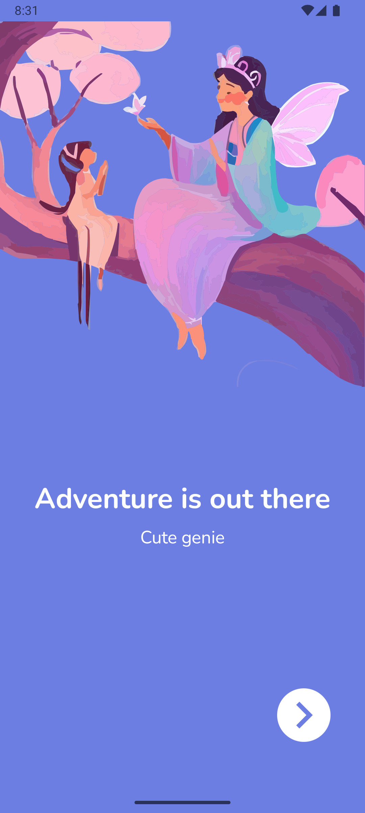
  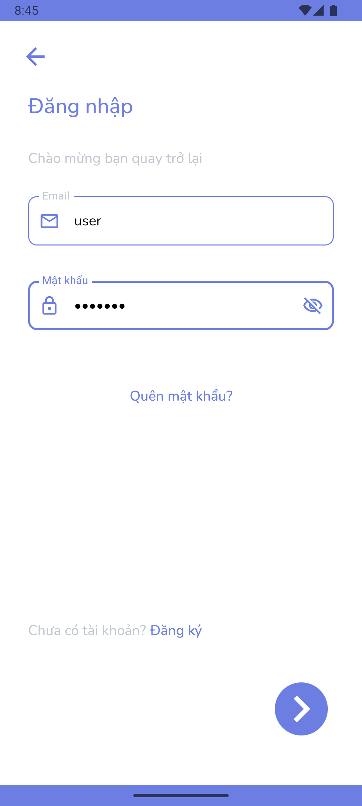
  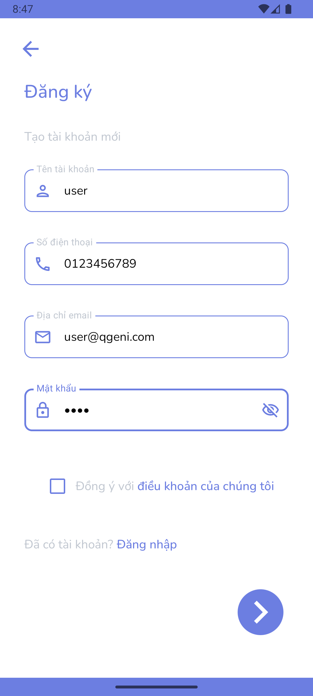
</div>

Giao diện chào mừng và hệ thống đăng nhập/đăng ký an toàn với xác thực JWT.

### 2. Trang chủ với trợ lý AI

<div align="center">
  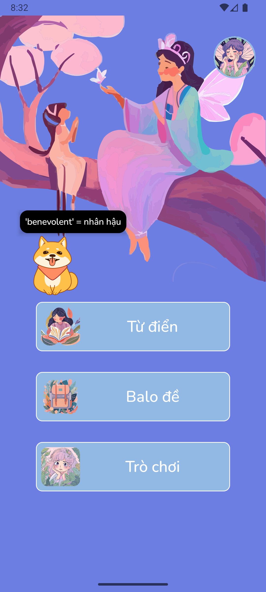
</div>

Trang chủ tích hợp trợ lý AI.

### 3. Tính năng từ điển (Dictionary)

<div align="center">
  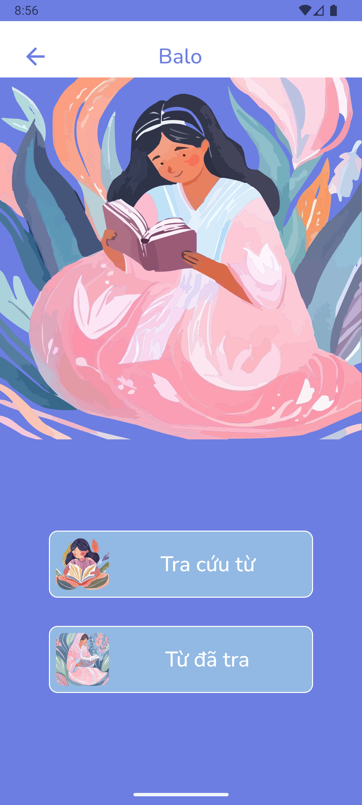
  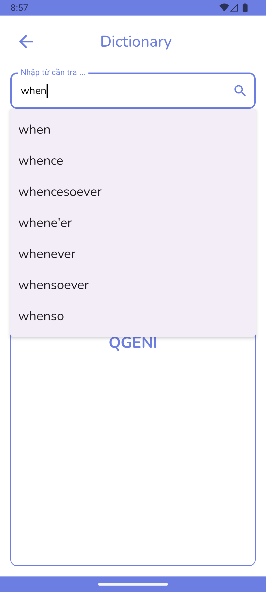
  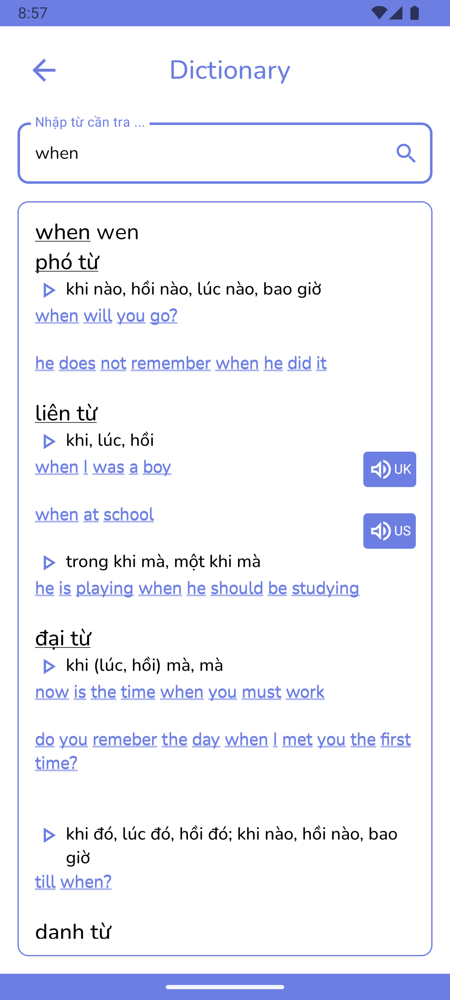
</div>

<div align="center">
  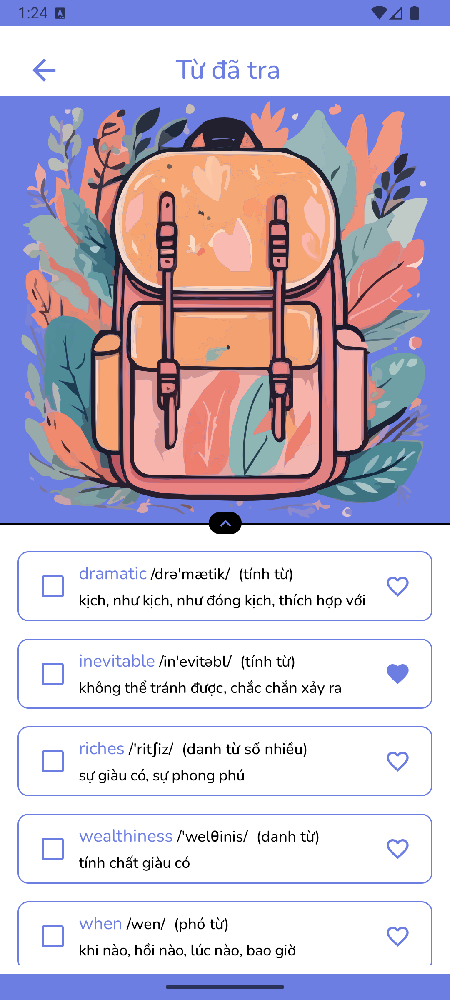
  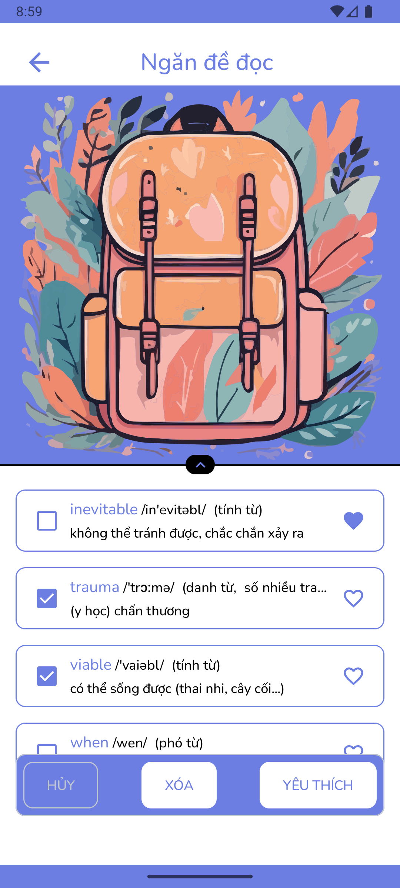
</div>

Từ điển thông minh với tính năng:

- Gợi ý từ khi nhập
- Hiển thị định nghĩa chi tiết
- Lưu lịch sử tra cứu
- Quản lý lịch sử

### 4. Tính năng luyện tập (Practice)

<div align="center">
  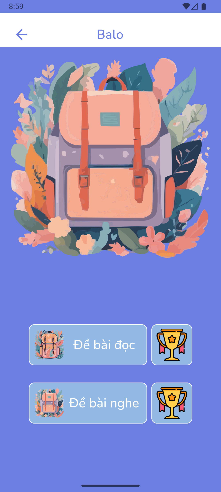
  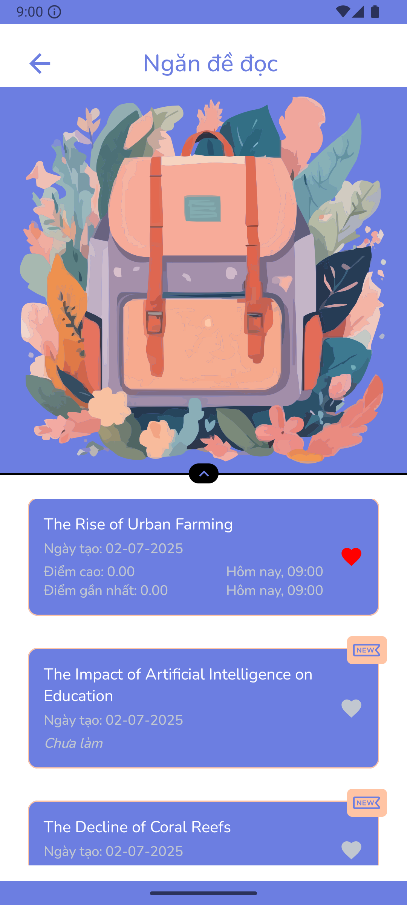
  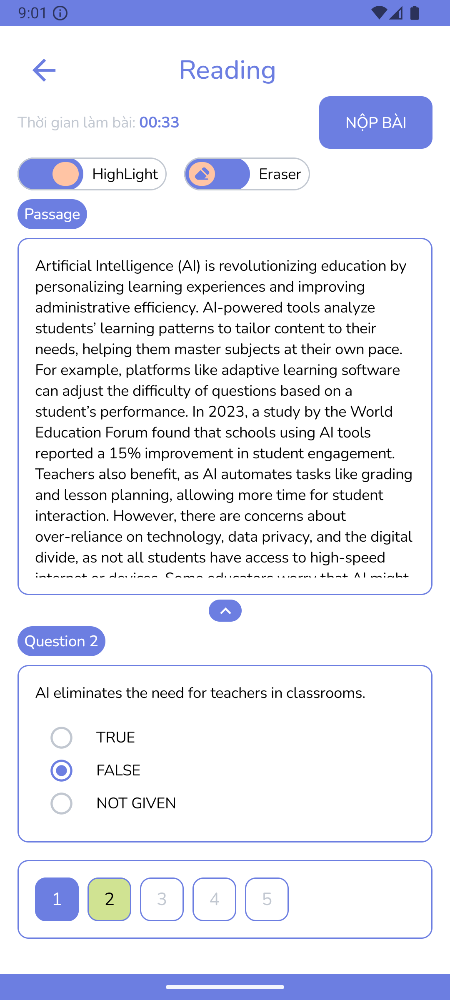
  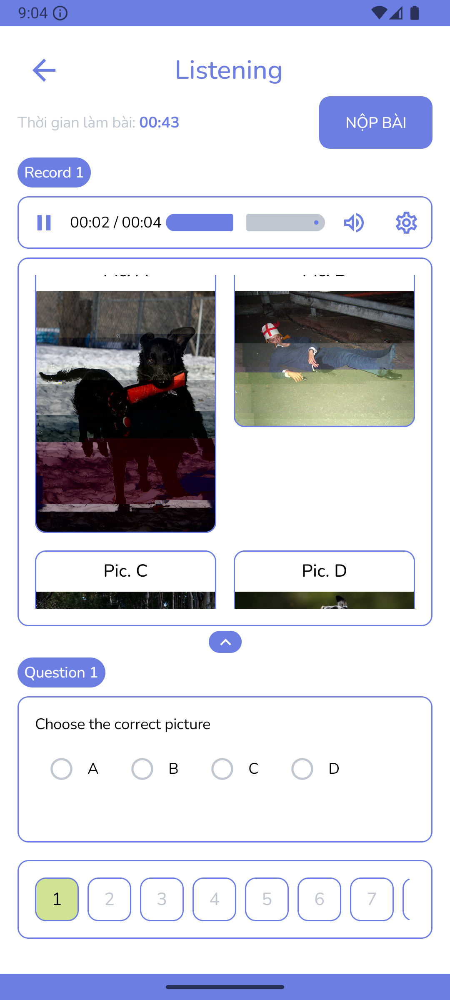
</div>

<div align="center">
  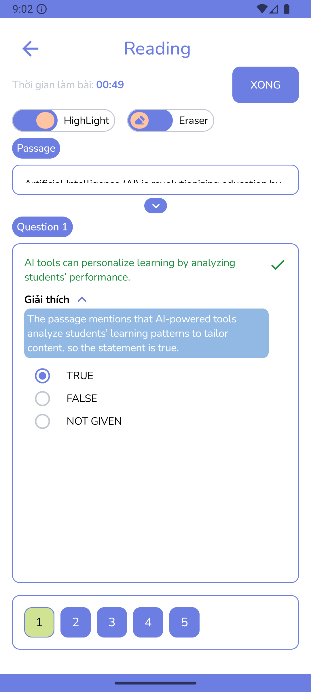
  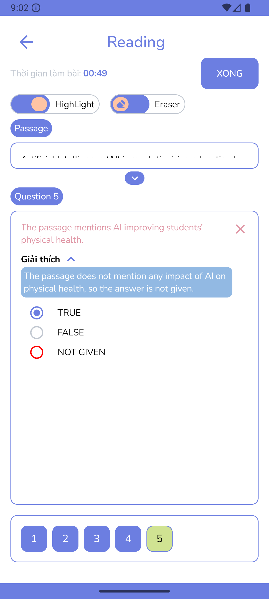
</div>

<div align="center">
  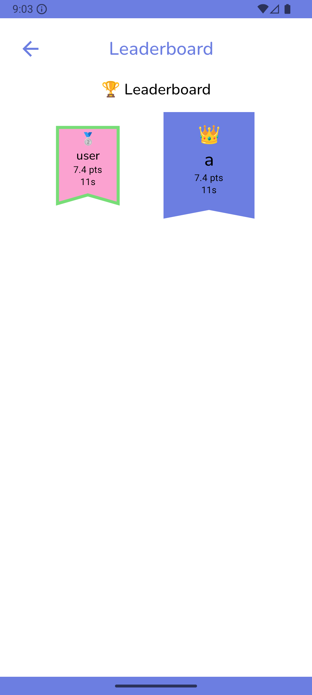
</div>

Hệ thống luyện tập đa dạng bao gồm:

- Bài tập đọc hiểu (Reading)
- Bài tập nghe hiểu (Listening)
- Giải thích chi tiết đáp án
- Hệ thống xếp hạng

### 5. Chatbot trợ lý

<div align="center">
  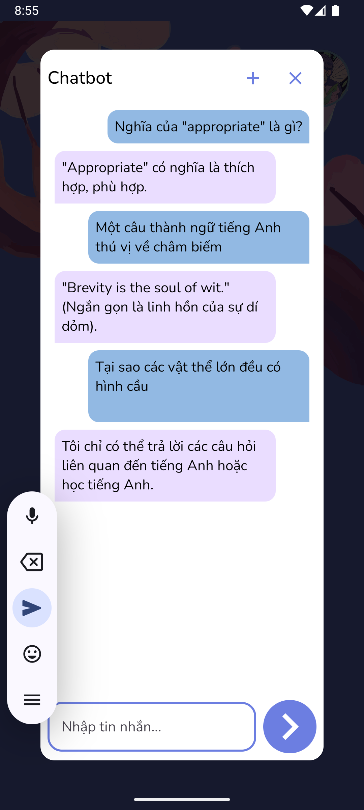
</div>

Trợ lý AI hỗ trợ học tập, giải đáp thắc mắc.

### 6. Trò chơi Wordle

<div align="center">
  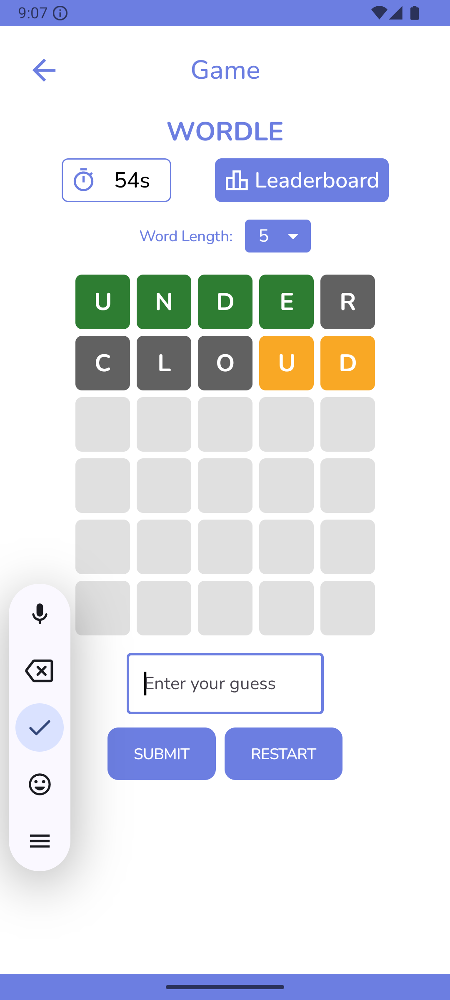
</div>

Game Wordle tiếng Anh giúp cải thiện vốn từ vựng.

### 7. Thông tin người dùng và thống kê

<div align="center">
  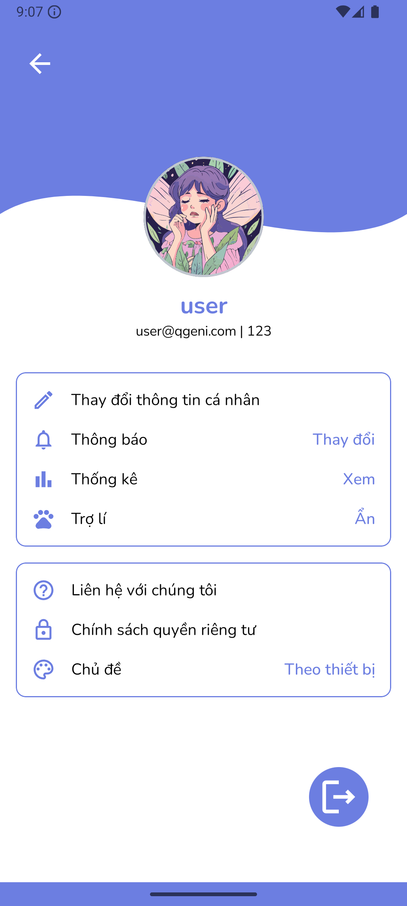
  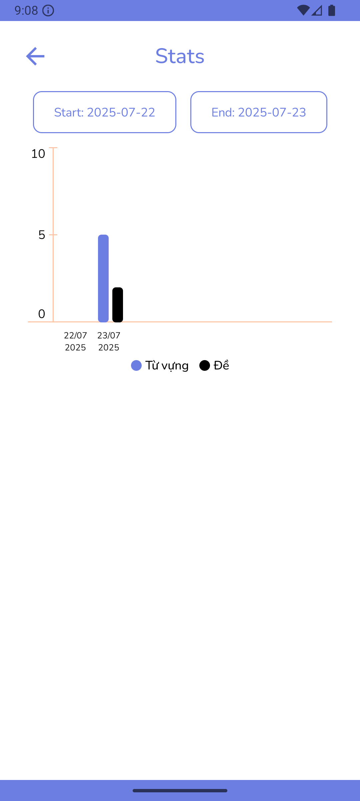
</div>

Quản lý thông tin cá nhân và theo dõi thống kê học tập chi tiết.

## 🏗️ Cấu trúc dự án

```
QGenI-Trumpcat/
├── backend/                 # Python Flask Backend
│   ├── app/                # Application modules
│   │   ├── chatbot/       # Chatbot functionality
│   │   ├── favorite/      # Favorites management
│   │   ├── file/          # File handling
│   │   ├── history/       # History tracking
│   │   ├── practice/      # Practice exercises
│   │   ├── user/          # User management
│   │   ├── word/          # Dictionary features
│   │   └── wordle/        # Wordle game
│   ├── data/              # Application data
│   └── test/              # Unit tests
├── frontend/              # Android Kotlin App
│   └── app/              # Main application
└── imgs/                 # Demo screenshots
```

## 🚀 Cài đặt và chạy ứng dụng

### Yêu cầu hệ thống

- Python 3.8+
- Android Studio Arctic Fox+
- Java 11+
- SQLite 3

### Backend Setup

```bash
cd backend
pip install -r requirements.txt
GEMINI_API_KEY=your_gemini_api_key python run.py
```

### Frontend Setup

1. Mở Android Studio
2. Import project từ thư mục `frontend/`
3. Sync Gradle dependencies
4. Cập nhật endpoint API (Backend URL) trong file `build.gradle` (và `/res/xml/network_security_config.xml` nếu như dùng `HTTP` thay vì `HTTPS`)
5. Chạy ứng dụng trên thiết bị/emulator

## 🔧 API Documentation

Backend cung cấp RESTful API với các endpoint chính:

- `/api/auth/` - Xác thực người dùng
- `/api/word/` - Tra cứu từ điển
- `/api/practice/` - Bài tập luyện tập
- `/api/chatbot/` - Trợ lý AI
- `/api/wordle/` - Game Wordle
- `/api/user/` - Quản lý người dùng

## 📊 Database Schema

Ứng dụng sử dụng SQLite với các bảng chính:

- `user` - Thông tin người dùng
- `word` - Từ vựng và định nghĩa
- `reading` và `listening` - Bài tập và câu hỏi
- `history` - Lịch sử hoạt động
